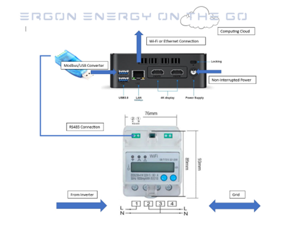

<div align="center">
	<a href="https://github.serenity.energy" style="font-size:1.2em; font-weight:bold; color:#2d8cff;">
		📖 View Full Documentation Site: https://github.serenity.energy
	</a>
</div>
<div align="center">
	<h1>⚡ <span style="color:#2d8cff">Hepek Web3 MQTT Master</span> 🚀</h1>
	<h3>All-in-One Dockerized Blockchain-Enabled Smart Meter Platform</h3>
	
	
	
	
</div>

---

## 🌟 Overview

Hepek Web3 MQTT Master is a unified platform for real-time energy monitoring, blockchain integration, and IoT device management. It leverages Docker, MQTT, and Web3 to deliver a secure, scalable, and automated smart meter solution.

---

## 🏗️ Architecture

<details>
<summary><strong>System Components</strong></summary>

- <span style="color:#2d8cff">**Dockerized Microservices**</span>: Isolated, reproducible environments for API, MQTT, and blockchain logic.
- <span style="color:#2ecc71">**MQTT Integration**</span>: Real-time meter data publishing to backend brokers.
- <span style="color:#9b59b6">**Web3 Blockchain**</span>: Smart contract interaction for energy tokens and secure transactions.
- <span style="color:#f39c12">**Modbus**</span>: Industrial protocol support for meter data acquisition.
- <span style="color:#e67e22">**Secrets Management**</span>: Encrypted device secrets and credentials.


</details>

---

## 🚀 Features

- 🔗 **Blockchain-Enabled**: Web3 smart contract support for energy tokens and secure transactions
- 📡 **MQTT Real-Time Data**: Publishes meter readings to MQTT brokers for analytics and monitoring
- 🐳 **Dockerized Deployment**: One-command setup and updates across devices
- 🔒 **Encrypted Secrets**: Secure storage of private keys and credentials
- ⚡ **Modbus Support**: Industrial-grade meter data acquisition
- 🛠️ **Auto-Deploy**: Automated updates and configuration management

---

## 🧩 Key Technologies

| Technology   | Purpose                        |
|--------------|--------------------------------|
| Python 3.10  | Core application logic         |
| FastAPI      | REST API & web server          |
| Web3.py      | Blockchain/Ethereum interface  |
| paho-mqtt    | MQTT client for IoT messaging  |
| Docker       | Containerization & orchestration|
| Modbus       | Meter data protocol            |

---

## 🔗 MQTT Integration

<details>
<summary><strong>How It Works</strong></summary>

1. **Data Generation**: Meter readings are generated or simulated.
2. **MQTT Client**: Publishes readings to broker using <span style="color:#2ecc71">`MQTTClient`</span>.
3. **Topics**: Data sent to structured topics for device and aggregate consumption.
4. **Config**: All settings in `.env` or environment variables.

**Example Topics:**
```
energy/{device_id}/raw
energy/{device_id}/power
energy/{device_id}/voltage
energy/all/readings
```

**Payload Example:**
```json
{
	"device_id": "M004_NSW_2095_Manly",
	"timestamp": "2025-11-18T12:30:45",
	"meter_reading": {
		"IMPORT": 51.31,
		"EXPORT": 157.91,
		"VOLTAGE": 240.1,
		"AMPS": 10.89,
		"PF": 0.91,
		"FREQUENCY": 49.27,
		"POWER": 2.61
	},
	"metadata": {"source": "web3-docker", "version": "1.0"}
}
```
</details>

---

## 🐳 Dockerized Deployment

<details>
<summary><strong>Container Setup & Auto-Deploy</strong></summary>

**Quick Start:**
```bash
git clone https://github.com/serenitysource/web3-docker.git
cd web3-docker
export MASTER_PASSWORD_FROM_SHELL="your_master_password"
sudo ./docker_build.sh
sudo docker-compose -f docker/docker-compose.yaml up -d
```

**Auto-Deploy:**
- Place `auto-deploy.sh` in `/usr/local/bin/` and add to cron for seamless updates.
- All secrets and configs are preserved and restored automatically.
</details>

---

## ⚙️ Setup & Usage

<details>
<summary><strong>Step-by-Step Guide</strong></summary>

### 1. <span style="color:#2ecc71">Install Dependencies</span>
```bash
sudo apt-get install python3-pip openssh-server
pip3 install -r requirements.txt
```

### 2. <span style="color:#2d8cff">Install Docker & Compose</span>
```bash
sudo apt update
sudo apt install apt-transport-https ca-certificates curl software-properties-common
curl -fsSL https://download.docker.com/linux/ubuntu/gpg | sudo gpg --dearmor -o /usr/share/keyrings/docker-archive-keyring.gpg
echo "deb [arch=$(dpkg --print-architecture) signed-by=/usr/share/keyrings/docker-archive-keyring.gpg] https://download.docker.com/linux/ubuntu $(lsb_release -cs) stable" | sudo tee /etc/apt/sources.list.d/docker.list > /dev/null
sudo apt install docker-ce
sudo curl -L https://github.com/docker/compose/releases/download/v2.4.1/docker-compose-`uname -s`-`uname -m` -o /usr/local/bin/docker-compose
sudo chmod +x /usr/local/bin/docker-compose
```

### 3. <span style="color:#9b59b6">Configure Environment</span>
- Set `MASTER_PASSWORD_FROM_SHELL` in your shell profile
- Run `python scripts/manage_secrets.py` to create encrypted secrets
- Edit `scripts/.env` for device-specific settings

### 4. <span style="color:#f39c12">Build & Run</span>
```bash
sudo ./docker_build.sh
sudo docker-compose -f docker/docker-compose.yaml up -d
```

### 5. <span style="color:#e67e22">Test MQTT</span>
```bash
python scripts/test_mqtt.py
```

</details>

---

## 🔒 Security & Best Practices

- Store secrets in `.env_secret` (never commit to git)
- Use SSL/TLS for MQTT in production
- Enable authentication and topic-level authorization on broker
- Set proper file permissions on secret files
- Regularly update Docker images and dependencies

---

## 🛠️ Troubleshooting & Support

<details>
<summary><strong>Common Issues & Solutions</strong></summary>

- **Connection Refused**: Check broker host/port, firewall, and broker status
- **Authentication Failed**: Verify MQTT username/password
- **SSL/TLS Errors**: Check certificates and port (usually 8883)
- **Permission Denied**: Add user to docker group: `sudo usermod -aG docker $USER`
- **Missing Env Vars**: Ensure `MASTER_PASSWORD_FROM_SHELL` is set
- **Logs**: Check `/var/log/auto-deploy.log` and container logs

For more, see [MQTT_INTEGRATION.md](web3-docker-master/MQTT_INTEGRATION.md) and code comments.
</details>

---

<div align="center">
	<strong>Made with ❤️ by the Hepek Web3 Team</strong>
</div>
