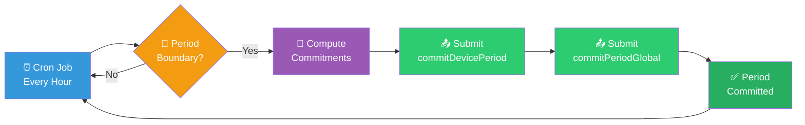
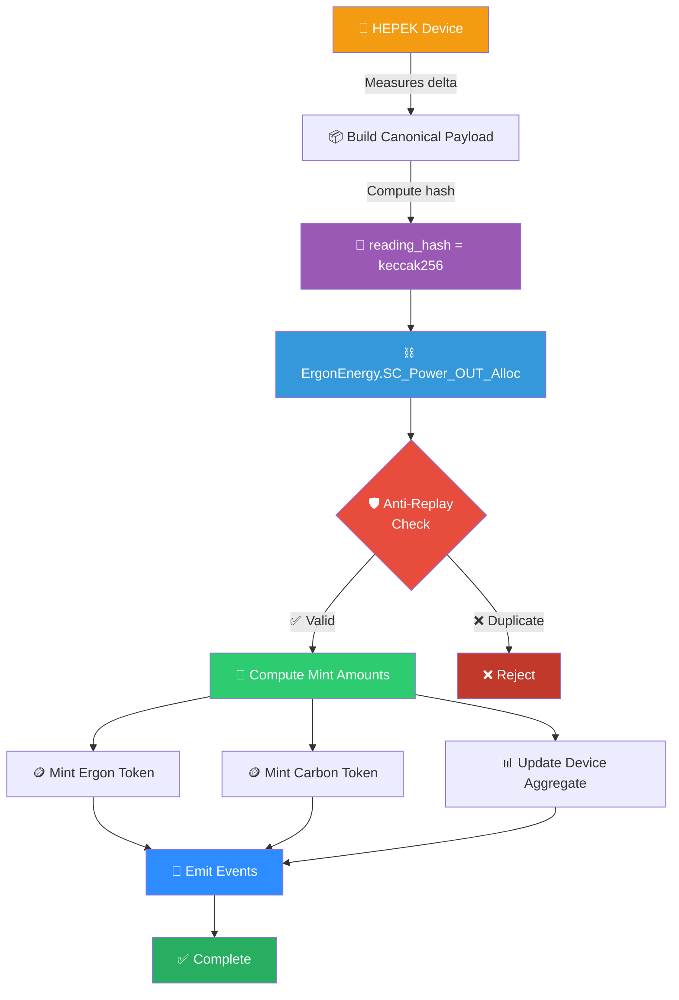
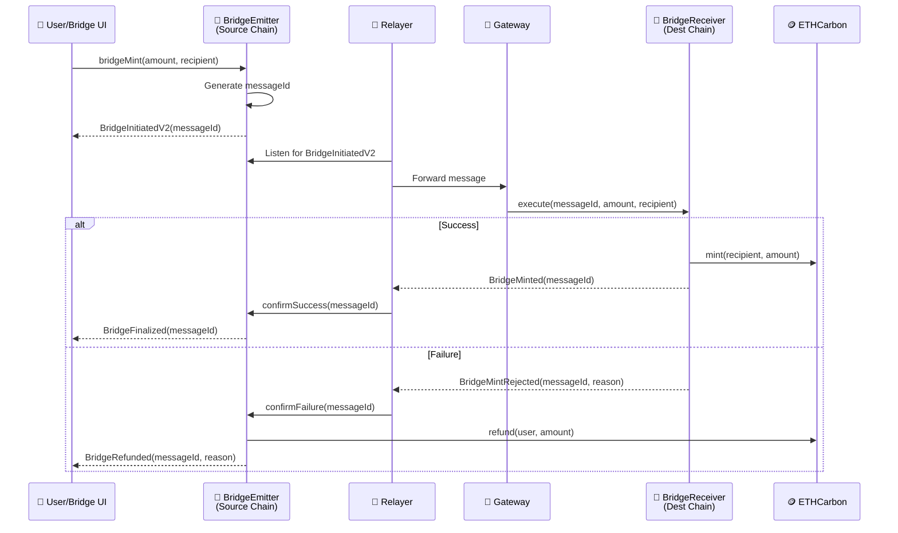
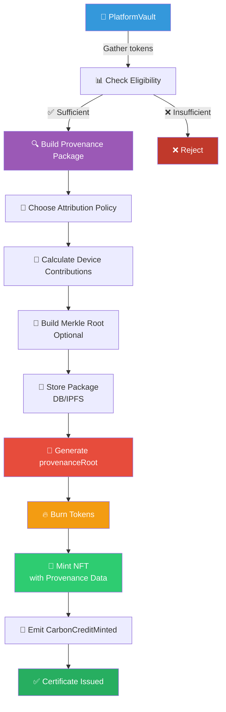

<div align="center">
<a href="https://github.serenity.energy" style="font-size:1.2em; font-weight:bold; color:#2d8cff;">
📖 View Full Documentation Site: https://github.serenity.energy
</a>
</div>
<div align="center">
<h1>🔐 <span style="color:#2d8cff">End-to-End Provenance Implementation</span> 🔗</h1>
<h3>Complete System Design: HEPEK → ErgonEnergy → Carbon → Bridge → ETHCarbon → Vault → CarbonCreditNFT</h3>


</div>

---

## 📘 Overview

This document consolidates the full design and flow narrative for an **audit-ready, event-centric provenance system** with **fast user UX** (single bridge transaction, no per-lot loops) and **strong provenance** anchored on the source chain and database.

<div style="background-color:#e7f3ff; padding:15px; border-radius:8px; border-left:4px solid #2d8cff; margin:20px 0;">
<strong>💡 Key Achievement:</strong> This design delivers both real-time fungible token transfers AND comprehensive audit trails by separating the UX layer (fast ERC20) from the provenance layer (anchored with deterministic hashes and events).
</div>

---

## 🎯 System Goals

This system must deliver three critical capabilities simultaneously:

<table>
<tr>
<td width="33%" align="center">
    <h3>⚡ Real-time UX</h3>
    <p>✅ ERC20 transfers are instant/fungible</p>
    <p>✅ Bridging is <strong>single-transaction</strong></p>
    <p>✅ No "lot loop" prompting MetaMask 50 times</p>
    <p>✅ Users experience seamless token operations</p>
</td>
<td width="33%" align="center">
    <h3>🔒 Audit-grade Provenance</h3>
    <p>✅ Prove <strong>which devices</strong> contributed to NFT mint</p>
    <p>✅ Prove approximate <strong>shares per device</strong></p>
    <p>✅ Trace back to <strong>minute-level meter readings</strong></p>
    <p>✅ Deterministic hash verification in DB</p>
</td>
<td width="33%" align="center">
    <h3>📊 Scalable Architecture</h3>
    <p>✅ Anchor minute readings via <code>reading_hash</code></p>
    <p>✅ Aggregate into one rolling slot per device</p>
    <p>✅ Use events + Merkle roots for auditability</p>
    <p>✅ No slowdowns during bridging operations</p>
</td>
</tr>
</table>

<div style="background-color:#e8f5e9; padding:15px; border-radius:8px; border-left:4px solid #2ecc71; margin:20px 0;">
<strong>✅ Design Achievement:</strong> This design achieves all goals by anchoring minute readings via a deterministic <code>reading_hash</code>, aggregating mints into one rolling slot per device (or per device+period), and using events + optional Merkle roots to preserve auditability without slowing down bridging.
</div>

---

## 🧩 Components & Responsibilities

### 🟠 A) HEPEK Device Agent (`contract.py`)

<table style="width:100%; border-collapse:collapse; margin:20px 0;">
<tr style="background-color:#2d8cff; color:white;">
    <th style="padding:10px; text-align:left;">Responsibility</th>
    <th style="padding:10px; text-align:left;">Details</th>
</tr>
<tr style="background-color:#f5f5f5;">
    <td style="padding:10px;"><strong>📊 Energy Measurement</strong></td>
    <td style="padding:10px;">Measures energy deltas minute-by-minute</td>
</tr>
<tr>
    <td style="padding:10px;"><strong>📦 Payload Building</strong></td>
    <td style="padding:10px;">Builds a canonical payload with normalized data</td>
</tr>
<tr style="background-color:#f5f5f5;">
    <td style="padding:10px;"><strong>🔐 Hash Computation</strong></td>
    <td style="padding:10px;">Computes deterministic <code>reading_hash = keccak256(canonical_json)</code></td>
</tr>
<tr>
    <td style="padding:10px;"><strong>⛓️ On-Chain Submission</strong></td>
    <td style="padding:10px;">Calls <code>ErgonEnergy.SC_Power_OUT_Alloc(produced_power, export_power, reading_hash)</code></td>
</tr>
</table>

<div style="background-color:#fff3e0; padding:15px; border-radius:8px; border-left:4px solid #f39c12; margin:20px 0;">
<strong>📌 Why This Matters:</strong> <code>reading_hash</code> becomes your immutable "audit anchor" across MQTT payload, DB record, and on-chain tx/event. This enables on-chain anti-replay protection—the same hash can't be accepted twice.
</div>

---

### 🟣 B) `ErgonEnergy.sol` (Energy Accounting + Mint Trigger)

<table style="width:100%; border-collapse:collapse; margin:20px 0;">
<tr style="background-color:#9b59b6; color:white;">
    <th style="padding:10px; text-align:left;">Function</th>
    <th style="padding:10px; text-align:left;">Purpose</th>
</tr>
<tr style="background-color:#f5f5f5;">
    <td style="padding:10px;"><strong>🛡️ Validation</strong></td>
    <td style="padding:10px;">Validates/guards meter readings, enforces anti-replay via <code>reading_hash</code></td>
</tr>
<tr>
    <td style="padding:10px;"><strong>🧮 Computation</strong></td>
    <td style="padding:10px;">Computes mint amounts for <strong>ERGON</strong> and <strong>CARBON</strong> based on deltas and formula rules</td>
</tr>
<tr style="background-color:#f5f5f5;">
    <td style="padding:10px;"><strong>🪙 Token Minting</strong></td>
    <td style="padding:10px;">Calls token contract minting functions</td>
</tr>
<tr>
    <td style="padding:10px;"><strong>📢 Event Emission</strong></td>
    <td style="padding:10px;">Emits audit events for complete provenance trail</td>
</tr>
</table>

<div style="background-color:#e7f3ff; padding:15px; border-radius:8px; border-left:4px solid #2d8cff; margin:20px 0;">
<strong>💡 Truth Boundary:</strong> This is where real-world energy becomes token supply. All minting decisions flow through this contract's validation logic.
</div>

---

### 🟢 C) `Carbon.sol` (Fungible Token + Provenance Structure)

**Key Design Change:** Move away from "minute lots" and toward:

<table style="width:100%; margin:20px 0;">
<tr>
<td width="50%" style="background-color:#e8f5e9; padding:20px;">
    <h4>✅ One Slot Per Device</h4>
    <p>Single aggregated balance tracked per device</p>
    <p><code>deviceAggregate[device] += mintedDelta</code></p>
</td>
<td width="50%" style="background-color:#e3f2fd; padding:20px;">
    <h4>✅ One Slot Per Device+Period</h4>
    <p>Aggregated balance per device per time period</p>
    <p>Daily/weekly/monthly bucketing for efficiency</p>
</td>
</tr>
</table>

**Benefits:**
- ⚡ Keeps transfers + bridging fast (single amount)
- 🔍 Provenance verifiable at retirement time
- 📊 Minimal on-chain storage overhead

---

### 🌉 D) BridgeEmitter / BridgeReceiver / Relayer

Bridge UX should be driven by **messageId correlation** for reliable status tracking.

<table style="width:100%; border-collapse:collapse; margin:20px 0;">
<tr style="background-color:#2d8cff; color:white;">
    <th style="padding:10px; text-align:left;">Component</th>
    <th style="padding:10px; text-align:left;">Events</th>
    <th style="padding:10px; text-align:left;">Purpose</th>
</tr>
<tr style="background-color:#f5f5f5;">
    <td style="padding:10px;"><strong>🚀 Source Chain</strong><br/><code>BridgeEmitter</code></td>
    <td style="padding:10px;"><code>BridgeInitiatedV2(messageId, ...)</code></td>
    <td style="padding:10px;">Emits deterministic <code>messageId</code> for tracking</td>
</tr>
<tr>
    <td style="padding:10px;"><strong>🎯 Destination Chain</strong><br/><code>BridgeReceiver</code></td>
    <td style="padding:10px;"><code>BridgeMinted(messageId, ...)</code><br/><code>BridgeMintRejected(messageId, ...)</code></td>
    <td style="padding:10px;">Confirms success or failure</td>
</tr>
<tr style="background-color:#f5f5f5;">
    <td style="padding:10px;"><strong>🔄 Relayer</strong></td>
    <td style="padding:10px;">Watches & Executes</td>
    <td style="padding:10px;">Watches source event → calls destination execute → reports back</td>
</tr>
</table>

<div style="background-color:#e8f5e9; padding:15px; border-radius:8px; border-left:4px solid #2ecc71; margin:20px 0;">
<strong>✅ Event-Centric Architecture:</strong> UI doesn't guess; it waits for deterministic events. This is the correct pattern for reliable bridge UX.
</div>

---

### 🔷 E) `ETHCarbon.sol` (Destination-Chain ERC20 Mirror)

**Purpose of destination chain token:**

- 💼 User holdings on the destination chain
- 🛍️ Marketplace trading and liquidity
- 🏦 Vault deposits and NFT mint cycle

<div style="background-color:#fff3e0; padding:12px; border-radius:6px; margin:15px 0;">
<strong>📌 Important:</strong> You do <strong>not</strong> need minute-level provenance replicated here. Provenance remains anchored on source chain + DB, and is resolved into a compact proof package at NFT retirement time.
</div>

---

### 🏦 F) `PlatformVault` + `CarbonCreditNFT`

**Vault is the "retirement gate":**

<table style="width:100%; border-collapse:collapse; margin:20px 0;">
<tr style="background-color:#9b59b6; color:white;">
    <th style="padding:10px; text-align:left;">Step</th>
    <th style="padding:10px; text-align:left;">Action</th>
    <th style="padding:10px; text-align:left;">Result</th>
</tr>
<tr style="background-color:#f5f5f5;">
    <td style="padding:10px;"><strong>1️⃣ Deposit</strong></td>
    <td style="padding:10px;">Tokens deposited/approved to vault</td>
    <td style="padding:10px;">Tokens locked for retirement</td>
</tr>
<tr>
    <td style="padding:10px;"><strong>2️⃣ Burn</strong></td>
    <td style="padding:10px;">Vault burns tokens when minting NFT</td>
    <td style="padding:10px;">Supply permanently reduced</td>
</tr>
<tr style="background-color:#f5f5f5;">
    <td style="padding:10px;"><strong>3️⃣ Mint NFT</strong></td>
    <td style="padding:10px;">Certificate NFT minted with provenance data</td>
    <td style="padding:10px;">Irreversible compliance action</td>
</tr>
</table>

<div style="background-color:#f3e5f5; padding:15px; border-radius:8px; border-left:4px solid #9b59b6; margin:20px 0;">
<strong>🎯 Audit Focus:</strong> Auditors care most about provenance <strong>here</strong>, at retirement. This is where detailed device attribution proofs are generated and committed.
</div>

---

## 🔑 Key Design Principle

### Separate the System into Two Layers

<table style="width:100%; margin:30px 0;">
<tr>
<td width="50%" style="background-color:#e3f2fd; padding:25px; vertical-align:top;">
    <h3>⚡ 1️⃣ Token UX Layer</h3>
    <h4 style="color:#2d8cff;">MUST BE FAST</h4>
    <ul>
        <li>✅ ERC20 transfers between users are standard</li>
        <li>✅ Bridge moves a <strong>single fungible amount</strong> per tx</li>
        <li>✅ No per-lot loops in UI</li>
        <li>✅ Real-time responsive user experience</li>
        <li>✅ No provenance overhead during transfers</li>
    </ul>
</td>
<td width="50%" style="background-color:#e8f5e9; padding:25px; vertical-align:top;">
    <h3>🔒 2️⃣ Provenance Layer</h3>
    <h4 style="color:#2ecc71;">MUST BE VERIFIABLE</h4>
    <ul>
        <li>✅ Anchored on <strong>source chain</strong> + DB</li>
        <li>✅ Uses deterministic reading hashes</li>
        <li>✅ Period/device commitments (optional)</li>
        <li>✅ Event logs as public audit trail</li>
        <li>✅ Provenance <em>resolved</em> and <em>committed</em> at NFT mint time</li>
    </ul>
</td>
</tr>
</table>

<div style="background-color:#e7f3ff; padding:20px; border-radius:10px; border:2px solid #2d8cff; margin:20px 0;">
<h4>🧠 Mental Model</h4>
<p><strong>Fungible tokens flow freely for UX.</strong> Provenance stays anchored at the source. When you need to prove provenance (at NFT retirement), you generate a proof package from the source chain + DB anchors.</p>
<p>This separation enables both speed AND verifiability.</p>
</div>

---

## 🔑 Data Anchoring with `reading_hash`

### Is `reading_hash` Enough?

**Yes** — if you also store it in:

<table style="width:100%; border-collapse:collapse; margin:20px 0;">
<tr style="background-color:#2d8cff; color:white;">
    <th style="padding:10px; text-align:center; width:25%;">📡 MQTT</th>
    <th style="padding:10px; text-align:center; width:25%;">💾 Database</th>
    <th style="padding:10px; text-align:center; width:25%;">⛓️ On-Chain</th>
    <th style="padding:10px; text-align:center; width:25%;">🔄 Reproducible</th>
</tr>
<tr>
    <td style="padding:15px; text-align:center; background-color:#f5f5f5;">✅ Payload</td>
    <td style="padding:15px; text-align:center;">✅ Record</td>
    <td style="padding:15px; text-align:center; background-color:#f5f5f5;">✅ Tx/Events</td>
    <td style="padding:15px; text-align:center;">✅ Deterministic</td>
</tr>
</table>

### Recommended Canonical Hash Payload

**Minimal + Sufficient fields:**

<table style="width:100%; border-collapse:collapse; margin:20px 0;">
<tr style="background-color:#9b59b6; color:white;">
    <th style="padding:10px; text-align:left;">Field</th>
    <th style="padding:10px; text-align:left;">Type</th>
    <th style="padding:10px; text-align:left;">Purpose</th>
</tr>
<tr style="background-color:#f5f5f5;">
    <td style="padding:8px;"><code>device_id</code></td>
    <td style="padding:8px;">address</td>
    <td style="padding:8px;">Device identifier (normalized)</td>
</tr>
<tr>
    <td style="padding:8px;"><code>timestamp</code></td>
    <td style="padding:8px;">uint256</td>
    <td style="padding:8px;">Stable bucket (e.g., epoch minute)</td>
</tr>
<tr style="background-color:#f5f5f5;">
    <td style="padding:8px;"><code>produced_power</code></td>
    <td style="padding:8px;">uint256</td>
    <td style="padding:8px;">Energy produced in period</td>
</tr>
<tr>
    <td style="padding:8px;"><code>export_power</code></td>
    <td style="padding:8px;">uint256</td>
    <td style="padding:8px;">Energy exported to grid</td>
</tr>
</table>

**Then:**
1. 📝 Canonical JSON encoding (sorted keys, stable separators)
2. 🔐 `keccak256` hash

### Include in MQTT Payload

<details>
<summary><strong>✅ Recommended Implementation Pattern (Click to Expand)</strong></summary>

```python
canonical_reading_hash = make_reading_hash(envelope)

mqtt_payload = {
    **(envelope.get("meter_reading") or {}),
    "device_id": envelope.get("device_id"),
    "timestamp": envelope.get("timestamp"),
    "metadata": envelope.get("metadata"),
    "canonical_reading_hash": canonical_reading_hash,
}
```

**Benefits:**
- ⚡ Makes correlation instant: MQTT → DB → chain tx/event
- 🔍 Enables deterministic audit verification
- 🛡️ Prevents replay attacks across systems
- 📊 Simplifies indexing and querying

</details>

<div style="background-color:#e8f5e9; padding:15px; border-radius:8px; border-left:4px solid #2ecc71; margin:20px 0;">
<strong>✅ Result:</strong> This creates an immutable, verifiable link across all system components without storing full payloads on-chain.
</div>

---

## 📢 Event Emission Guidelines (Audit Log API)

Events are your **"public audit trail"** and your UI's **correctness anchor**.

### 1️⃣ Reading Accepted (ErgonEnergy)

**Choose based on privacy needs:**

<table style="width:100%; margin:20px 0;">
<tr>
<td width="50%" style="background-color:#fff9e6; padding:20px;">
    <h4>⚠️ Minimal (Privacy-Focused)</h4>
    <p><code>ReadingAccepted(device, user, readingHash, timestampBucket)</code></p>
    <p><strong>Use when:</strong> Hiding production values from public chain</p>
</td>
<td width="50%" style="background-color:#d4edda; padding:20px;">
    <h4>✅ Full (Transparency-Focused)</h4>
    <p><code>ReadingAccepted(device, user, readingHash, produced, exported, timestampBucket)</code></p>
    <p><strong>Use when:</strong> Full transparency required for public audit</p>
</td>
</tr>
</table>

**Why emit this:**
- ✅ Proves chain accepted exact `reading_hash`
- ✅ Enables off-chain indexing
- ✅ Enables audit reconstruction

---

### 2️⃣ Minting (ErgonEnergy → Carbon)

```solidity
event PowerOutAllocated(
    address indexed device,
    bytes32 indexed readingHash,
    uint256 ergonMinted,
    uint256 carbonMinted,
    uint256 factor,
    bytes32 priceRefHash
);
```

**Purpose:**
- 🔗 Links reading hash to minted value
- 📊 Provides allocation factors for audit
- 💰 Records pricing reference for compliance

---

### 3️⃣ Carbon Aggregation (Carbon.sol)

**If using one rolling slot per device:**

```solidity
event DeviceLotUpdated(
    address indexed device,
    uint256 newTotal,
    uint256 delta,
    uint256 indexed periodId
);
```

**If using period commitments:**

```solidity
event DevicePeriodCommitted(
    address indexed device,
    uint256 indexed periodId,
    uint256 periodSum,
    bytes32 deviceRoot
);

event PeriodGlobalCommitted(
    uint256 indexed periodId,
    uint256 globalSum,
    bytes32 globalRoot
);
```

**Why:**
- 📉 Keeps on-chain state compact
- 🔒 Preserves tamper-evident commitments auditors can verify
- ⚡ Enables efficient proof generation

---

### 4️⃣ Bridge Lifecycle (Emitter/Receiver)

<table style="width:100%; border-collapse:collapse; margin:20px 0;">
<tr style="background-color:#2d8cff; color:white;">
    <th style="padding:10px; text-align:left;">Chain</th>
    <th style="padding:10px; text-align:left;">Event</th>
    <th style="padding:10px; text-align:left;">Purpose</th>
</tr>
<tr style="background-color:#f5f5f5;">
    <td style="padding:10px;"><strong>🚀 Source</strong></td>
    <td style="padding:10px;"><code>BridgeInitiatedV2(messageId, ...)</code></td>
    <td style="padding:10px;">User initiates bridge transfer</td>
</tr>
<tr>
    <td style="padding:10px;"><strong>✅ Destination</strong></td>
    <td style="padding:10px;"><code>BridgeMinted(messageId, ...)</code></td>
    <td style="padding:10px;">Successful bridge completion</td>
</tr>
<tr style="background-color:#f5f5f5;">
    <td style="padding:10px;"><strong>❌ Destination</strong></td>
    <td style="padding:10px;"><code>BridgeMintRejected(messageId, reason)</code></td>
    <td style="padding:10px;">Bridge failure with reason</td>
</tr>
</table>

<div style="background-color:#e7f3ff; padding:15px; border-radius:8px; border-left:4px solid #2d8cff; margin:20px 0;">
<strong>💡 UI Reliability:</strong> UI can reliably show completion/failure without polling or guessing. The <code>messageId</code> correlation ensures deterministic status tracking.
</div>

---

## 📦 "One Slot per Device" Model

### Meaning

Inside `Carbon.sol` you maintain:

```solidity
mapping(address => uint256) public deviceAggregate;

function mint(address device, uint256 amount) internal {
    deviceAggregate[device] += amount;
    _mint(device, amount);  // Standard ERC20 mint
}
```

**ERC20 user balances are still standard.**

### Important: ERC20 Transfers Should NOT "Move Device Slots"

<table style="width:100%; margin:20px 0;">
<tr>
<td width="50%" style="background-color:#e8f5e9; padding:20px;">
    <h4>🔍 Device Slots</h4>
    <p>Describe <strong>supply provenance</strong></p>
    <p>"How much came from which device"</p>
    <p><strong>Static tracking of origin</strong></p>
</td>
<td width="50%" style="background-color:#e3f2fd; padding:20px;">
    <h4>💼 User Balances</h4>
    <p>Describe <strong>ownership</strong></p>
    <p>"Who currently holds tokens"</p>
    <p><strong>Dynamic, freely transferable</strong></p>
</td>
</tr>
</table>

**Therefore:**
- ✅ User-to-user transfers remain normal ERC20 operations
- ✅ Provenance is resolved at retirement time
- ✅ No overhead on every transfer

<div style="background-color:#fff3e0; padding:15px; border-radius:8px; border-left:4px solid #f39c12; margin:20px 0;">
<strong>📌 Key Insight:</strong> Provenance describes where supply came from, not where tokens currently are. This separation enables fungibility while maintaining audit trails.
</div>

---

## 🌉 Bridging with Fungibility

### Where Provenance Should Be Enforced

Because CARBON is fungible, tracking perfect provenance through arbitrary user transfers is expensive and often unnecessary.

### Recommended Convention

<div style="background-color:#e7f3ff; padding:20px; border-radius:10px; border:2px solid #2d8cff; margin:20px 0;">
<h4>🎯 Core Principle</h4>
<p><strong>Provenance is proven at NFT retirement time</strong>, not at every transfer/bridge hop.</p>
</div>

**Bridging becomes:**

<table style="width:100%; border-collapse:collapse; margin:20px 0;">
<tr style="background-color:#2d8cff; color:white;">
    <th style="padding:10px; text-align:left;">Aspect</th>
    <th style="padding:10px; text-align:left;">Implementation</th>
</tr>
<tr style="background-color:#f5f5f5;">
    <td style="padding:10px;"><strong>🚀 Transfer Speed</strong></td>
    <td style="padding:10px;">Fast fungible transfer across networks</td>
</tr>
<tr>
    <td style="padding:10px;"><strong>🔒 Provenance Storage</strong></td>
    <td style="padding:10px;">Remains source-of-truth on source chain + DB</td>
</tr>
<tr style="background-color:#f5f5f5;">
    <td style="padding:10px;"><strong>📊 Verification</strong></td>
    <td style="padding:10px;">Deferred to NFT mint/retirement time</td>
</tr>
</table>

---

## 🎯 Provenance at NFT Mint (Retirement)

At NFT mint time (e.g., burning ~860 CARBON), generate a **Provenance Package** off-chain:

<details>
<summary><strong>📋 Complete Provenance Package Generation Process (Click to Expand)</strong></summary>

<br/>

### Step 1️⃣: Choose Attribution Policy

<table style="width:100%; border-collapse:collapse;">
<tr style="background-color:#9b59b6; color:white;">
    <th style="padding:10px;">Policy</th>
    <th style="padding:10px;">Description</th>
    <th style="padding:10px;">Use Case</th>
</tr>
<tr style="background-color:#f5f5f5;">
    <td style="padding:10px;"><strong>FIFO by Period</strong></td>
    <td style="padding:10px;">First-in-first-out allocation</td>
    <td style="padding:10px;">Time-ordered attribution</td>
</tr>
<tr>
    <td style="padding:10px;"><strong>Proportional by Device</strong></td>
    <td style="padding:10px;">Split by device contribution</td>
    <td style="padding:10px;">Fair distribution</td>
</tr>
<tr style="background-color:#f5f5f5;">
    <td style="padding:10px;"><strong>Whitelist-Only Devices</strong></td>
    <td style="padding:10px;">Only certified devices</td>
    <td style="padding:10px;">Compliance requirements</td>
</tr>
</table>

### Step 2️⃣: Build Device Attribution List

```json
[
    {"device": "0x1234...", "amount": 300},
    {"device": "0x5678...", "amount": 250},
    {"device": "0x9abc...", "amount": 310}
]
```

### Step 3️⃣: (Optional) Build Merkle Root

Merkle tree over the minute readings used:
- **Leaves:** `(reading_hash, device, amount, timestamp)`
- **Root:** Cryptographic commitment to all readings

### Step 4️⃣: Store Package

- 💾 **Database:** Full provenance details
- 🌐 **IPFS:** Immutable, distributed storage
- 🔗 **CID/Hash:** Content-addressed reference

### Step 5️⃣: Commit Compact Reference

```solidity
bytes32 provenanceRoot = keccak256(
    abi.encodePacked(
        devices,
        amounts,
        periodRange,
        policyId,
        merkleRoot
    )
);
```

Store in NFT metadata and/or on-chain storage.

</details>

<div style="background-color:#e8f5e9; padding:15px; border-radius:8px; border-left:4px solid #2ecc71; margin:20px 0;">
<strong>✅ Result:</strong> This is sufficient for audit and keeps UX fast. Auditors get full provenance when needed, users get frictionless transfers.
</div>

---

## ⏰ Periodic Commitments: Can the Contract "Auto-Run" Commits?

<div style="background-color:#fff3e0; padding:15px; border-radius:8px; border-left:4px solid #f39c12; margin:20px 0;">
<strong>⚠️ Important Limitation:</strong> Smart contracts can't wake up by themselves. EVM contracts cannot self-trigger based on time passage.
</div>

### Automation Pattern Required

If you use `commitDevicePeriod()` / `commitPeriodGlobal()`:

**A bot/relayer must call them on a schedule:**

<table style="width:100%; border-collapse:collapse; margin:20px 0;">
<tr style="background-color:#2d8cff; color:white;">
    <th style="padding:10px; text-align:left;">Component</th>
    <th style="padding:10px; text-align:left;">Responsibility</th>
</tr>
<tr style="background-color:#f5f5f5;">
    <td style="padding:10px;"><strong>⏰ Timer Service</strong></td>
    <td style="padding:10px;">Runs on schedule (daily/weekly/monthly)</td>
</tr>
<tr>
    <td style="padding:10px;"><strong>🔍 Period Detector</strong></td>
    <td style="padding:10px;">Checks if period rolled over</td>
</tr>
<tr style="background-color:#f5f5f5;">
    <td style="padding:10px;"><strong>🧮 Commit Calculator</strong></td>
    <td style="padding:10px;">Computes period sums and Merkle roots</td>
</tr>
<tr>
    <td style="padding:10px;"><strong>📤 Transaction Submitter</strong></td>
    <td style="padding:10px;">Submits commit transactions to blockchain</td>
</tr>
</table>

**Example Automation Flow:**



---

## 🔄 System Flow Diagrams

### 1️⃣ Runtime Minting Flow (Minute-Level)



<details>
<summary><strong>📝 Detailed Step-by-Step Explanation (Click to Expand)</strong></summary>

<br/>

**Step 1: Measurement**
- 📡 HEPEK device measures energy delta (produced/exported)
- ⏱️ Minute-by-minute granularity

**Step 2: Payload Construction**
- 📦 Build canonical payload with normalized fields
- 🔢 Include: device_id, timestamp, produced_power, export_power

**Step 3: Hash Generation**
- 🔐 Compute deterministic `reading_hash = keccak256(canonical_json)`
- ✅ Ensures reproducibility for audit

**Step 4: On-Chain Submission**
- ⛓️ Call `ErgonEnergy.SC_Power_OUT_Alloc(produced, exported, reading_hash)`
- 📝 Include hash for anti-replay protection

**Step 5: Validation**
- 🛡️ Contract checks `usedReading[reading_hash]`
- ❌ Reject if already seen
- ✅ Accept if new

**Step 6: Minting**
- 🧮 Compute ERGON and CARBON amounts based on formulas
- 🪙 Mint tokens to device/user address
- 📊 Update device aggregate tracking

**Step 7: Event Emission**
- 📢 Emit events for audit indexing
- 🔗 Link reading_hash to mint amounts
- ✅ Transaction complete

</details>

---

### 2️⃣ Bridge Flow (Single TX, Event-Correlated)



<div style="background-color:#e7f3ff; padding:15px; border-radius:8px; border-left:4px solid #2d8cff; margin:20px 0;">
<strong>💡 Key Feature:</strong> UI listens for <code>BridgeMinted</code> or <code>BridgeMintRejected</code> events correlated by <code>messageId</code>. No guessing, no polling needed. Reliable, deterministic status tracking.
</div>

---

### 3️⃣ NFT Mint (Retirement) Provenance Flow



**Auditor Verification Process:**

<table style="width:100%; border-collapse:collapse; margin:20px 0;">
<tr style="background-color:#9b59b6; color:white;">
    <th style="padding:10px; text-align:left;">Step</th>
    <th style="padding:10px; text-align:left;">Auditor Verifies</th>
    <th style="padding:10px; text-align:left;">Evidence Source</th>
</tr>
<tr style="background-color:#f5f5f5;">
    <td style="padding:10px;"><strong>1️⃣ Burn Tx</strong></td>
    <td style="padding:10px;">Tokens were burned at retirement</td>
    <td style="padding:10px;">On-chain transaction</td>
</tr>
<tr>
    <td style="padding:10px;"><strong>2️⃣ Provenance Root</strong></td>
    <td style="padding:10px;">Root matches package hash</td>
    <td style="padding:10px;">NFT metadata / on-chain storage</td>
</tr>
<tr style="background-color:#f5f5f5;">
    <td style="padding:10px;"><strong>3️⃣ Device Attribution</strong></td>
    <td style="padding:10px;">Devices listed contributed correctly</td>
    <td style="padding:10px;">Provenance package (DB/IPFS)</td>
</tr>
<tr>
    <td style="padding:10px;"><strong>4️⃣ Reading Samples</strong></td>
    <td style="padding:10px;">Sample reading_hash values exist</td>
    <td style="padding:10px;">Database + blockchain events</td>
</tr>
<tr style="background-color:#f5f5f5;">
    <td style="padding:10px;"><strong>5️⃣ Hash Verification</strong></td>
    <td style="padding:10px;">Can reproduce reading_hash from data</td>
    <td style="padding:10px;">Database meter readings</td>
</tr>
</table>

---

## ✅ Practical Next Steps

<table style="width:100%; border-collapse:collapse; margin:20px 0;">
<tr style="background-color:#2d8cff; color:white;">
    <th style="padding:10px; text-align:center; width:10%;">Step</th>
    <th style="padding:10px; text-align:left;">Action</th>
    <th style="padding:10px; text-align:left;">Outcome</th>
</tr>
<tr style="background-color:#f5f5f5;">
    <td style="padding:10px; text-align:center;"><strong>1️⃣</strong></td>
    <td style="padding:10px;">Keep deterministic <code>reading_hash</code> exactly as-is</td>
    <td style="padding:10px;">✅ Include in MQTT + DB + chain</td>
</tr>
<tr>
    <td style="padding:10px; text-align:center;"><strong>2️⃣</strong></td>
    <td style="padding:10px;">Make Carbon mint aggregation default to <strong>one slot per device</strong></td>
    <td style="padding:10px;">✅ Or device+period for time-based attribution</td>
</tr>
<tr style="background-color:#f5f5f5;">
    <td style="padding:10px; text-align:center;"><strong>3️⃣</strong></td>
    <td style="padding:10px;">Make bridging <strong>lot-agnostic</strong></td>
    <td style="padding:10px;">✅ Single ERC20 amount per bridge tx</td>
</tr>
<tr>
    <td style="padding:10px; text-align:center;"><strong>4️⃣</strong></td>
    <td style="padding:10px;">Resolve attribution at <strong>NFT mint time</strong></td>
    <td style="padding:10px;">✅ Generate provenance package<br/>✅ Commit root/hash into NFT<br/>✅ Retain minute evidence in DB</td>
</tr>
</table>

<div style="background-color:#e8f5e9; padding:20px; border-radius:10px; border:2px solid #2ecc71; margin:30px 0;">
<h4>✅ Implementation Checklist</h4>
<ul>
    <li>☑️ Implement deterministic <code>reading_hash</code> generation</li>
    <li>☑️ Add <code>reading_hash</code> to MQTT payloads</li>
    <li>☑️ Store <code>reading_hash</code> in database with tx metadata</li>
    <li>☑️ Implement anti-replay check in <code>ErgonEnergy.sol</code></li>
    <li>☑️ Add comprehensive event emissions</li>
    <li>☑️ Implement device aggregate tracking in <code>Carbon.sol</code></li>
    <li>☑️ Implement event-driven bridge with <code>messageId</code></li>
    <li>☑️ Build provenance package generator for NFT mints</li>
    <li>☑️ Set up period commit automation (optional)</li>
</ul>
</div>

---

## 🔧 Notes for Future Hardening (Optional)

<details>
<summary><strong>💡 Advanced Enhancement Ideas (Click to Expand)</strong></summary>

<br/>

### Policy ID System

Add an explicit `policyId` to provenance packages:

<table style="width:100%; border-collapse:collapse;">
<tr style="background-color:#9b59b6; color:white;">
    <th style="padding:10px;">Policy ID</th>
    <th style="padding:10px;">Method</th>
    <th style="padding:10px;">Description</th>
</tr>
<tr style="background-color:#f5f5f5;">
    <td style="padding:10px;"><code>0x01</code></td>
    <td style="padding:10px;">FIFO</td>
    <td style="padding:10px;">First-in-first-out time-based allocation</td>
</tr>
<tr>
    <td style="padding:10px;"><code>0x02</code></td>
    <td style="padding:10px;">Proportional</td>
    <td style="padding:10px;">Proportional by device contribution</td>
</tr>
<tr style="background-color:#f5f5f5;">
    <td style="padding:10px;"><code>0x03</code></td>
    <td style="padding:10px;">Whitelist</td>
    <td style="padding:10px;">Only whitelisted devices included</td>
</tr>
</table>

### Period Range Tracking

Add `periodRange` to provenance for compliance snapshots:

```solidity
struct ProvenanceMetadata {
    uint256 periodStart;
    uint256 periodEnd;
    uint256 policyId;
    bytes32 deviceWhitelistRoot;
    bytes32 readingsMerkleRoot;
}
```

### Proof Pointers

Store compact "proof pointer" in NFT metadata:

- 🌐 **IPFS CID:** Content-addressed immutable storage
- 💾 **Database ID:** Internal reference for quick lookup
- 🔗 **Combined Reference:** Both for redundancy

**Example NFT Metadata:**

```json
{
    "name": "Carbon Credit Certificate #123",
    "description": "860 CARBON retired",
    "attributes": [
        {"trait_type": "Amount Retired", "value": "860"},
        {"trait_type": "Provenance CID", "value": "Qm..."},
        {"trait_type": "Provenance Root", "value": "0x..."},
        {"trait_type": "Device Count", "value": "15"}
    ]
}
```

</details>

---

## 📁 Repository Structure Suggestion

```text
📦 Carbon-Provenance-System
├── 📂 contracts/
│   ├── ErgonEnergy.sol          # Energy accounting + mint trigger
│   ├── Carbon.sol               # Fungible token + device aggregates
│   ├── Ergon.sol                # Energy token
│   ├── BridgeEmitter.sol        # Source chain bridge
│   ├── BridgeReceiver.sol       # Destination chain bridge
│   ├── ETHCarbon.sol            # Destination ERC20 mirror
│   ├── PlatformVault.sol        # Retirement vault
│   └── CarbonCreditNFT.sol      # Certificate NFT
│
├── 📂 device/
│   ├── contract.py              # HEPEK device agent
│   ├── hash_utils.py            # Deterministic hash functions
│   └── mqtt_publisher.py        # MQTT integration
│
├── 📂 backend/
│   ├── proof-service/           # Provenance package generator
│   │   ├── attribution.py       # Policy implementations
│   │   ├── merkle.py           # Merkle tree builder
│   │   └── storage.py          # IPFS/DB storage
│   │
│   ├── mqtt-ingest/             # MQTT listener + DB writer
│   │   ├── listener.py
│   │   └── db_writer.py
│   │
│   ├── provenance-package/      # Package generation service
│   │   ├── generator.py
│   │   └── verifier.py
│   │
│   └── period-commit-bot/       # Automated period commits
│       ├── scheduler.py
│       └── commit_tx.py
│
└── 📂 frontend/
    ├── bridge-app/              # Bridge UI
    │   ├── BridgeForm.tsx
    │   └── StatusTracker.tsx
    │
    └── dashboard/               # Analytics dashboard
        ├── DeviceMetrics.tsx
        └── ProvenanceViewer.tsx
```

<div style="background-color:#e7f3ff; padding:15px; border-radius:8px; border-left:4px solid #2d8cff; margin:20px 0;">
<strong>💡 Organization:</strong> This structure separates concerns clearly—smart contracts, device agents, backend services, and frontend applications each have dedicated directories with focused responsibilities.
</div>

---

## 📚 Additional Resources

<details>
<summary><strong>🔗 Useful Links and Documentation (Click to Expand)</strong></summary>

<br/>

### Technical References

- 📖 **ERC-20 Standard:** [EIP-20](https://eips.ethereum.org/EIPS/eip-20)
- 📖 **ERC-721 NFT Standard:** [EIP-721](https://eips.ethereum.org/EIPS/eip-721)
- 📖 **Merkle Trees:** [Wikipedia](https://en.wikipedia.org/wiki/Merkle_tree)
- 📖 **IPFS Documentation:** [docs.ipfs.tech](https://docs.ipfs.tech/)

### Security Best Practices

- 🔒 **Smart Contract Security:** [ConsenSys Best Practices](https://consensys.github.io/smart-contract-best-practices/)
- 🔒 **OpenZeppelin Contracts:** [docs.openzeppelin.com/contracts](https://docs.openzeppelin.com/contracts/)
- 🔒 **Solidity Security:** [Solidity Docs - Security Considerations](https://docs.soliditylang.org/en/latest/security-considerations.html)

### Audit Standards

- ✅ **Carbon Credit Standards:** [Gold Standard](https://www.goldstandard.org/)
- ✅ **Renewable Energy Certificates:** [I-REC Standard](https://www.irecstandard.org/)
- ✅ **Blockchain for Sustainability:** [World Economic Forum Report](https://www.weforum.org/reports/)

</details>

---

<div align="center" style="background-color:#2d8cff; padding:30px; border-radius:15px; margin:30px 0;">
    <h2 style="color:white; margin:0;">🚀 Ready to Build Trustless Energy Systems</h2>
    <p style="color:white; margin:10px 0;">Empowering transparent, auditable, and scalable energy token infrastructure</p>
    <br/>
    
    
    
    
</div>

---

## 📄 License / Disclaimer

Internal engineering & audit documentation for Carbon Bridge / Ergon ecosystem.

<div style="background-color:#fff3e0; padding:15px; border-radius:8px; border-left:4px solid #f39c12; margin:20px 0;">
<strong>⚠️ Disclaimer:</strong> This documentation is for internal use and audit purposes. The system design and implementation should be reviewed by qualified blockchain security auditors before production deployment.
</div>

---

<div align="center">
    <strong>Made with ❤️ by the Serenity Energy Team</strong>
    <br/><br/>
    <a href="https://github.serenity.energy">📖 Documentation</a> • 
    <a href="https://github.com/serenitysource">💻 GitHub</a> • 
    <a href="https://github.serenity.energy/support">🤝 Support</a>
    <br/><br/>
    <p style="color:#888; font-size:0.9em;">
    🌍 Building the future of transparent, auditable renewable energy systems<br/>
    ⚡ Blockchain-anchored • 🔒 Cryptographically verified • 📊 Audit-ready
    </p>
</div>
